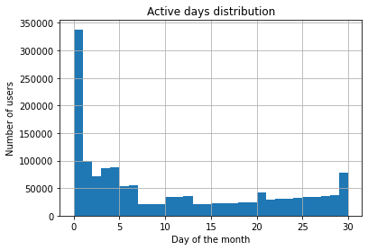
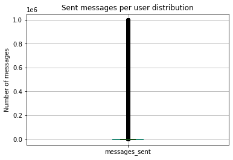
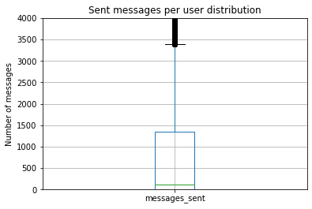
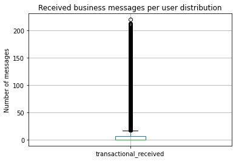

# New Feature Impact Evaluation

The task is to evaluate impact of a new feature, proposed by Product Manager. The idea is to add an easy and fast way to create reminders from incoming messages. Previously this feature was only available from notes. Now the system will identify date/time patterns in incoming messages and suggest the user an option of setting a reminder.

 ## Summary
 
The analysis consists of following parts:
<ol>
    <li>Preprocessing the data</li>
    Here I check data validity and consistency
    <li>Feature impact evaluation</li>
    In this part I explain my assumption, define core target audience - receivers of business accounts who have not yet had experience of using reminders, and calculate what impact the new feature will have on them
    <li>Conclusion</li>
    Here I give the result and suggest the future steps and aditional research
</ol>

## Preprocessing the data


```python
import pandas as pd
import matplotlib.pyplot as plt
```


```python
df = pd.read_csv('monthly_activity.csv')
```


```python
df.sample(5)
```


<div>
<style scoped>
    .dataframe tbody tr th:only-of-type {
        vertical-align: middle;
    }

    .dataframe tbody tr th {
        vertical-align: top;
    }

    .dataframe thead th {
        text-align: right;
    }
</style>
<table border="1" class="dataframe">
  <thead>
    <tr style="text-align: right;">
      <th></th>
      <th>user_id</th>
      <th>active_days</th>
      <th>messages_sent</th>
      <th>messages_received</th>
      <th>transactional_received</th>
      <th>has_used_my_notes_ever</th>
      <th>my_notes_days</th>
      <th>my_notes_messages</th>
      <th>has_used_reminders_ever</th>
      <th>reminders_days</th>
      <th>reminders_messages</th>
    </tr>
  </thead>
  <tbody>
    <tr>
      <th>557621</th>
      <td>557621</td>
      <td>30</td>
      <td>2924</td>
      <td>3890</td>
      <td>0</td>
      <td>1</td>
      <td>7</td>
      <td>117</td>
      <td>1</td>
      <td>1</td>
      <td>1</td>
    </tr>
    <tr>
      <th>757094</th>
      <td>757094</td>
      <td>4</td>
      <td>53</td>
      <td>47</td>
      <td>0</td>
      <td>0</td>
      <td>0</td>
      <td>0</td>
      <td>0</td>
      <td>0</td>
      <td>0</td>
    </tr>
    <tr>
      <th>1430184</th>
      <td>1430184</td>
      <td>0</td>
      <td>0</td>
      <td>0</td>
      <td>0</td>
      <td>0</td>
      <td>0</td>
      <td>0</td>
      <td>0</td>
      <td>0</td>
      <td>0</td>
    </tr>
    <tr>
      <th>1005195</th>
      <td>1005195</td>
      <td>3</td>
      <td>79</td>
      <td>66</td>
      <td>0</td>
      <td>0</td>
      <td>0</td>
      <td>0</td>
      <td>0</td>
      <td>0</td>
      <td>0</td>
    </tr>
    <tr>
      <th>106855</th>
      <td>106855</td>
      <td>0</td>
      <td>0</td>
      <td>0</td>
      <td>0</td>
      <td>0</td>
      <td>0</td>
      <td>0</td>
      <td>0</td>
      <td>0</td>
      <td>0</td>
    </tr>
  </tbody>
</table>
</div>


```python
df.info()
```

    <class 'pandas.core.frame.DataFrame'>
    RangeIndex: 1500000 entries, 0 to 1499999
    Data columns (total 11 columns):
     #   Column                   Non-Null Count    Dtype
    ---  ------                   --------------    -----
     0   user_id                  1500000 non-null  int64
     1   active_days              1500000 non-null  int64
     2   messages_sent            1500000 non-null  int64
     3   messages_received        1500000 non-null  int64
     4   transactional_received   1500000 non-null  int64
     5   has_used_my_notes_ever   1500000 non-null  int64
     6   my_notes_days            1500000 non-null  int64
     7   my_notes_messages        1500000 non-null  int64
     8   has_used_reminders_ever  1500000 non-null  int64
     9   reminders_days           1500000 non-null  int64
     10  reminders_messages       1500000 non-null  int64
    dtypes: int64(11)
    memory usage: 125.9 MB
    

We have information on 1,5 million users, including their activity for a given month in messages, business messages, notes and reminders. <br>
Dataset is full, has no missing data, all columns have self explanatory names and correct data types.


```python
df.duplicated().sum() #First I'd like to check the set for duplicates
```


    0


No duplicates found

Now I d like to check data in the columns to see if the everithing looks fine and we have no abnormalities.


```python
df['active_days'].hist(bins=30)
plt.title('Active days distribution')
plt.xlabel('Day of the month')
plt.ylabel('Number of users'); 
#Let's look at active days distribution first. It will show well on the histogram by the number of days in our month
```


    

    


The distribution looks plausible. We have a peak at 0 days, wihch is the group of churned users. There are also few distinguishable groups of users
<ul>
    <li>First groups up to 7 days and 10-12 days - occasional users, who only log in every 3-5 days to communicate with specific contacts of theirs</li> 
    <li>We also have a visible peak at 20 days - that might compose those who use Viber mostly to communicate with their work contacts, thus activity is limited to work days</li>
    <li>Last significant group are active users, who consider Viber as their primary messenger and use it on the daily basis</li>
</ul>
Of cause it is all pure conjecture based on given data, as this set is not enough for definitive user experience description and user segmentation, which is regardless outside of the scope of the task.


```python
df.boxplot(column='messages_sent') 
plt.title('Sent messages per user distribution')
plt.ylabel('Number of messages');
# Let's have a look at the messages distribution.
# The dispersion might be rather big, so a boxplot might be a better way to visualise distribution of this parameter.
```


    

    


There is quiet a number of outliers, so it is hard to see the most part of distribution. I'll increase the scale to see better.


```python
df.boxplot(column='messages_sent')
plt.ylim(0,4000)
plt.title('Sent messages per user distribution')
plt.ylabel('Number of messages');
```


    

    


The distribution is shifted to zero, wich is mostly because I'm looking at the full data set, including numerous charned users. Normal (lying within 3 sigmas) users sent less then 3500 messages a month, which looks natural. However we have a significant number of extreme outliers.


```python
print(df['messages_sent'].max()) #Let's look, what is the maximum number of messages sent and received per month
print(df['messages_received'].max())
```

    999987
    6387
    

Over 6K received messages is a lot, but quite plausible, however almost a million sent messages looks not too realistic. The person should send almost 1500 messages every hour to get to this figure. That might be a mistake in data, or it might be users, doing some group mailings from their accounts. That might be a point to be checked. <br> However our feature in question regards receiving messages, not sending, thus for the purpose of this analysis we can leave this anomaly aside. Otherwise I would suggest to check authenticity of this data, and if these are in fact correct figures, to extract this users into specific group to be studied separately.


```python
df.boxplot(column='transactional_received') #Now let's look at the users of business messages
plt.title('Received business messages per user distribution')
plt.ylabel('Number of messages');
```


    

    


Agin the distribution is shifted to zero, as I did not exclude non-users, however everithing looks fine. A little over 200 messages for top users looks perfectly plausible.


```python
business_message_users = df.query('transactional_received!=0') #Let us see how many customers use this feature
business_message_users.shape[0]
```


    416184


A little over 400K which make a bit less then 30%. That explains the distribution


```python
business_message_users['transactional_received'].sum()/business_message_users.shape[0]
#Let's see the mean number of business messages per active user of the feature
```


    64.28845895084866


64 messages per user with the maximum of 200 looks fine. Probably most active users are subscribed to multiple business accounts.


```python
a=df.query('has_used_my_notes_ever==0') 
#Now I check if there is a mistake with notes usage flag. If any users with notes messages accidently received a 0
a['my_notes_days'].sum()
```


    0


No mistakes here


```python
b=df.query('has_used_my_notes_ever==1')
b['my_notes_days'].median() #Let's see haw many days of notesusage on the average has a user of this feature
```


    4.0


4 days per user on the average, again, assuming here might be churned users of this feature looks plausible


```python
b.query('my_notes_days!=0')['user_id'].count()/len(b) 
#Let's see the sare of active monthly users of this feature among those who ever used it
```


    0.8720295899897694


13% of users dropped out of this specific feature. It is unclear what is our timeframe, when was the feature inroduced and how long the cohort we have data for lives already alltogether, so it is hard to evaluate this figure, but it lookes rather good regardless timeframe.


```python
print(b['my_notes_messages'].median()) 
#I'll see the median number of notes per user to avoid shift due to churned 13%
print(b['my_notes_messages'].max())
#And a maximum numrber of notes per user
```

    57.0
    367
    

57 notes per user per month with 367 as a maximum looks pretty good, that means that active users of the feature utilize it  quiet actively.


```python
c=df.query('has_used_reminders_ever==0')
c['reminders_days'].sum()#Same check if the flag is correct for reminder users
```


    0


All fine here


```python
reminder_users =df.query('has_used_reminders_ever==1')
reminder_users['reminders_days'].median() #Let's look how overall reminder days look like
```


    1.0


```python
print(reminder_users['reminders_days'].min()) #And frames for this criteria
print(reminder_users['reminders_days'].max())
```

    0
    9
    


```python
print(reminder_users['reminders_messages'].min()) #And overall frames for number of reminders per person
print(reminder_users['reminders_messages'].max())
```

    0
    9
    

Among those who ever used reminders the median usage days is 1 day and the top amount 9 days, same for number of reminders. That looks plausible as number of important events or tasks to remember, that you'd go to notes for should not be too large, and there are other options to put up with ones calendar.

Dataset alltogether looks fine, and could be further explored now

## Feature impact evaluation


```python
active_users = df.query('active_days!=0') 
#First let's separate active users as there's no point in looking to chrned ones for the purpose of this analysis
active_users['user_id'].count()/len(df)
```


    0.774532


We have a retention rate of 77,5%, which puts churn at 22,5%. I do not know the baseline for Viber so it is hard to give any quolitative evaluation to this number

For the purpose of this research I suggest to take <b>users of business messages</b> as the core target audience of the new feature. The reason behind it is the folowing. Most of business acounts that send messages to users are service providers (banks, beauti specialist, health and wellness providers ets). A lot of the above might set certain appointments with their clients, be it visit to a dantist, many-pedy appointment or an appointment with an attorney. At the same time all the interaction with such a service provider might be regulated via the messenger, it is unlikely, that after setting an appointement with a masseuse client receives a follow up calender notification. So this particular segment of users will benefit the most from an opportunity to create reminders directly from received messages. <br>We could consider those who use Viber primerely as a communication means with work contacts as another target audience. However the conjuncture that users  are active 20 days a moth are exactly these users is rather far fetched and should be verified first, which current dataset doesnt'y permit, moreover these users might have work mail as another means of communication and they might already have this need covered by mail agent calendar, so the benifit for those is less significant.


```python
print(business_message_users.shape[0]) #Let us see, how many users of business messages do we have
print(business_message_users['has_used_reminders_ever'].sum()) #And how many of those have already experience with reminders
```

    416184
    38797
    

According to my assumption we have a base of 377K users within our group, who are potential users for the new feature. It is the active receivers of messages from business accounts who do not have prior experience of using reminders. I suppose that those who already use reminders actively cannot be considered as incremental and those who churned from reminders probably did not find this particular feature useful thus might not come back to it


```python
df.query('has_used_reminders_ever==1').shape[0]/df.query('has_used_my_notes_ever==1').shape[0]
#Here I calculate share of those who used reminders amnog those who used notes
```


    0.2527709136696309


As a base for evaluating possible share of users of target audience of the new feature who will adapt it I will take share of those who ever used reminders within notes users. As previously reminders feature existed within notes, possible measure of reminders penetration can be extrapolated from this figure. <br> Thus we might conclude that initially around 25% of potential target audience will try the new feature


```python
reminder_share = df.query('reminders_days!=0').shape[0]/df.query('my_notes_days!=0').shape[0]
reminder_share #Here I calculate share of active notes users who also use reminders actively
```


    0.17372988426911942


I assume that some initial users of the new feature might churn, so for the final measure of impact  I'd rather take the share of active users of reminders within active users of notes? which is 17,4%


```python
impact_audience = (business_message_users.shape[0] - business_message_users['has_used_reminders_ever'].sum())*reminder_share
impact_audience #Here I multiplie my chosen TA on the extrapolated share and get the predictive figure
```


    65563.39983467017


```python
impact_audience/active_users.shape[0] 
#And finally calculate what share of active users will be involved with introduction of the new feature
```


    0.05643270158381248


According to my calculations approximately 5,6% of active users of Viber messenger will benefit from the opportunity to set reminders from incoming messages.

## Conclusion

The rough forecasrt of the feature impact is 5,6% of active users.<br> 
<br>However in order to make a decision I would still prefere to go through some additional research.
<ol>
    <li>First conserning our core target audience - receivers of business messages, it would be useful to get classification of businesses, that are senders of such messages, some industries are more likely to regulate appointments with clients on the regular basis, then others.</li>
    <li>If it is technicaly possible to currently flag messages that contain any sort of timestamps, it could be very interesting to explore, what is the share of messages, potentially susceptable to the new feature in question within the structure of business messages, that will help to make more accurate forecast</li>
    <li>Those users who utilize messagers for business comunication could be another angle to explore. I am not sure if such a share is significant enough within viber structure, to explore, but we could check. I might assume that those users have more activity within working hours then an average user, however this hypothesis might not stand verification.</li>
    <li>In case we have/had ever introduced a feature, involving some call to action, it would be useful to explore users responce to it as well.</li>
</ol>
